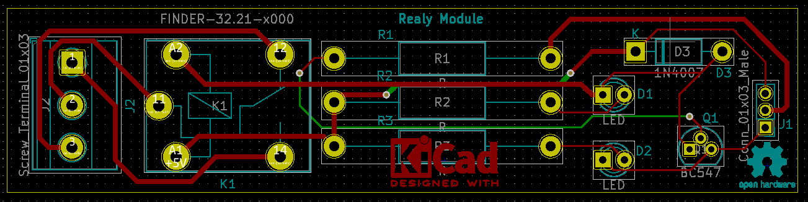
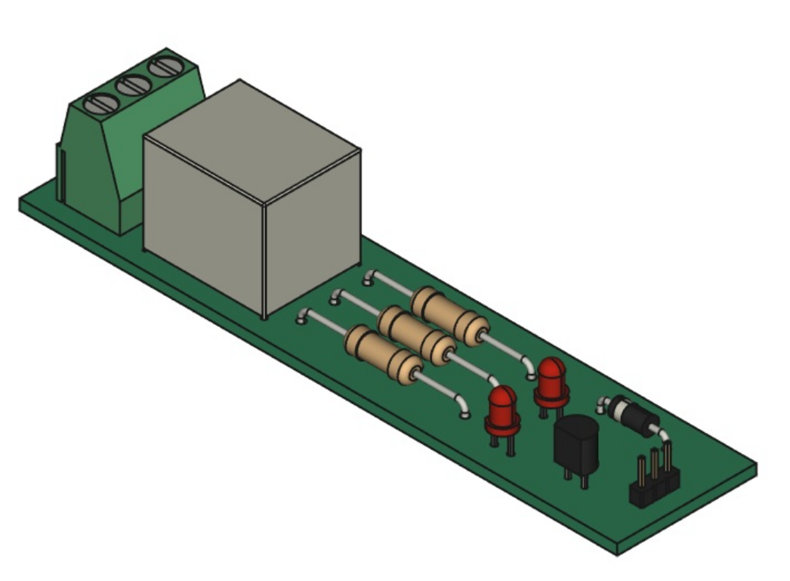

# Kicad Tutorial
* STM32F030 Circuit

*pcb Layout Top*

*pcb Layout Bottom*

## Shematic

## FreeCad
*pcb Layout Top*

*pcb Layout Top*

Hints:
* Circuit design in two layers with kicad version 5.1.5.

* 3D mode USB connector of the site: https://www.snapeda.com/parts/1050170001/Molex/view-part/?ref=search&t=USB_Micro-B_Molex-105017-0001

* In addition to wiring all routes, polygon is also considered ground and is located in the first layer.

* Circuit design with easyeda software: (Folder (doc)>-easyeda.pdf)

# Relay Module

*pcb Layout*

## Shematic

## FreeCad
*pcb 3d Layout*

For 3d Model we used kicadStepUpMod in FreeCAD software.

Hints:
* Circuit design in two layers with kicad version 5.1.9.

## Installing
Download and install your corresponding version of FreeCAD from https://wiki.freecadweb.org/Download

automatically using the FreeCAD Add-on Manager (https://github.com/FreeCAD/FreeCAD-addons) (bundled in to 0.17 dev version under Tools Menu)
manually by copying the kicadStepUpMod folder to the Mod sub-directory of the FreeCAD application.

## Designer
Saeed Ghorbani

Email: sa_ghorbani95@yahoo.com

Linkedin: www.linkedin.com/in/saeedghorbani
